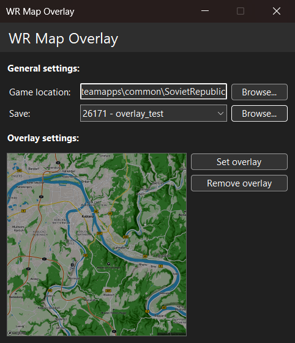

# WR Map Overlay

A simple utility for **Workers & Resources: Soviet Republic** that allows you to overlay an image onto the terrain.

    

## How to Use

- **Make a backup of your save!**
- Provide the path to the game folder (the folder containing the game executable).
- Select the save you want to modify. The app will only display saves from the `save_terraineditor` folder, but you can choose any save that **is not** compressed.
- Click **Set overlay** and select your image.
- Click **Remove overlay** to restore the default ground texture.
- Reload the game.

## Notes

- In order for the overlay to work, you must set the `Terrain Depth` to `Normal` (the lowest setting) in the game settings.
- All overlays are copied to the `media_soviet/overlays` directory.
